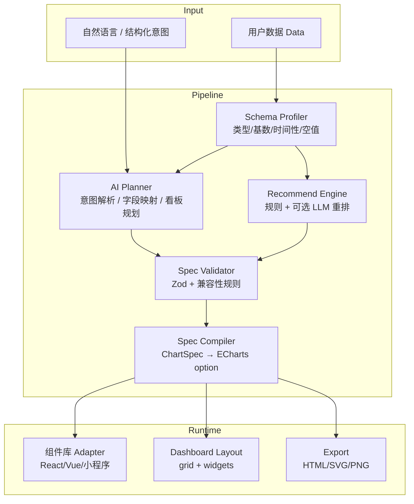

# AI-ECharts 组件库 · 图表生成 · 跨端复用方案

> 目标：构建一套以 **Apache ECharts** 为渲染引擎、以 **声明式 ChartSpec** 为契约、以 **LLM 做决策而非做计算** 的 AI 原生图表组件库，并支持自然语言 / 结构化数据驱动的 Dashboard 自动组合。

---

## 0. 核心结论（先看这三句话）

1. **不要让 LLM 直接写完整 ECharts `option`**。ECharts option 高度多态、字段依赖复杂，LLM 极易出错。应让 AI 产出轻量、可校验的中间协议（ChartSpec / ChartIR），再由确定性编译器生成 option。
2. **LLM 只看 Schema + 小样本，不做全量数据变换**。完整数据始终在本地/服务端用确定性代码聚合、映射、渲染，避免幻觉与隐私风险。
3. **跨端复用的关键不是「各框架各包一套图表」**，而是 **共享 Core（类型 + Spec + 编译 + 主题 + 推荐）**，各平台只写薄 Adapter（React / Vue / 小程序 / Node 导出）。

---

## 1. 问题定义与边界

### 1.1 用户输入形态（你提到的两类）

| 输入 | 说明 | 系统行为 |
|------|------|----------|
| A. 结构化数据 | CSV / JSON / 表结构 / 已有字段映射 | Schema 分析 → 推荐图表 → 生成 Spec → 渲染 |
| B. 自然语言 + 数据 | 「按地区对比销售额」「生成销售看板」 | NL 理解 → 意图/字段映射 → 推荐/组合 → Spec → 渲染 |
| 共同前提 | **用户必然会提供数据** | 数据是一等公民；AI 只决策「怎么看」，不捏造数据 |

### 1.2 产品三层能力

```
┌─────────────────────────────────────────────────────────┐
│  L3  AI Dashboard Composer（多图组合 / 布局 / 洞察）      │
├─────────────────────────────────────────────────────────┤
│  L2  AI Chart Agent（NL→Spec / 推荐 / 迭代修改）         │
├─────────────────────────────────────────────────────────┤
│  L1  Chart Component Library（声明式图表组件 + 主题）     │
└─────────────────────────────────────────────────────────┘
                         ▲
                         │  统一 ChartSpec
                         │
              ┌──────────┴──────────┐
              │   @ai-echarts/core  │
              └─────────────────────┘
```

### 1.3 明确不做 / 延后做

- 不把「自由生成任意 ECharts JS 代码」作为默认路径（安全、不稳定）。
- 第一期不做「无数据纯聊天编故事图」；无数据则拒绝生成。
- 地图下钻、复杂图交互编辑器可放二期。

---

## 2. 业界可借鉴方案（调研摘要）

| 方案 | 关键思路 | 对本项目的启示 |
|------|---------|----------------|
| [AntV GPT-Vis](https://gpt-vis.antv.vision/) | AI 友好语法 + 流式渲染 + 框架无关 + MCP/Skill | 提供「AI 易生成的中间语法」；流式与容错很重要 |
| [OpenVizAI](https://github.com/jaygajera17/OpenVizAI) | LLM 只决定 chartSpec；JS 对全量数据做变换 | **混合管线**：决策用 AI，执行用确定性代码 |
| [EChartify](https://github.com/grokify/echartify) | 非多态 ChartIR → compile → ECharts option | 中间表示要扁平、Zod 可校验、无 oneOf 地狱 |
| [Echarts-AI-Skill](https://github.com/davaded/Echarts-AI-Skill) / [echarts-chartpage](https://github.com/RiverThrimp/echarts-chartpage) | ChartRequest → recommend → generate → HTML/SVG；CLI + MCP | 流程拆成可编排步骤；白名单图表类型 |
| [DataSense](https://github.com/devyanic11/DataSense) | Schema 内省 + 多 Agent（分析 / 配置） | Dashboard 用多角色 Agent；LLM 不碰全量数据 |
| [WrenAI](https://github.com/Canner/WrenAI) | 语义层 + Text-to-SQL + GenBI | 若未来接数据库，引入语义层/字段业务含义 |
| [chart-platform-library](https://github.com/tamilakk/chart-platform-library) / [@efxlab](https://github.com/electroheadfx/efx-libs) | core + react/vue/server 分包 | Monorepo：core 共享，渲染层薄封装 |
| vue-echarts / echarts-for-react | 官方生态封装实践 | 按需注册、ResizeObserver、生命周期 dispose |

**共识**：`数据 → Schema →（LLM）意图/Spec →（确定性）编译 option → 渲染`。

---

## 3. 总体架构



### 3.1 推荐仓库结构（pnpm monorepo）

```text
ai-echarts/
├── packages/
│   ├── core/                 # @ai-echarts/core  纯 TS，零 UI
│   │   ├── schema/           # ChartSpec / DashboardSpec / DatasetSchema
│   │   ├── profile/          # 数据画像
│   │   ├── recommend/        # 图表推荐（规则优先）
│   │   ├── compile/          # Spec → ECharts option
│   │   ├── theme/            # 主题 token → ECharts theme
│   │   └── prompts/          # System prompt / few-shot / JSON Schema 导出
│   ├── ai/                   # @ai-echarts/ai   LLM 适配层
│   │   ├── providers/        # OpenAI / Claude / 本地模型
│   │   ├── agents/           # ChartAgent / DashboardAgent / RefineAgent
│   │   └── tools/            # recommend_chart / generate_spec / patch_spec
│   ├── react/                # @ai-echarts/react
│   ├── vue/                  # @ai-echarts/vue
│   ├── mini/                 # @ai-echarts/mini  微信/uni-app 等
│   ├── server/               # @ai-echarts/server  Node 端 SVG/PNG
│   └── mcp/                  # @ai-echarts/mcp   Agent 工具协议
├── apps/
│   ├── playground/           # 组件+AI 演示
│   └── docs-site/
└── examples/
```

**原则**：`core` 不依赖 React/Vue/DOM；所有平台消费同一套 Spec。

---

## 4. 一、组件库构建方案

### 4.1 分层设计

| 层 | 职责 | 示例 |
|----|------|------|
| Primitive | 生命周期、resize、主题、loading、按需 echarts.use | `<BaseChart option={...} />` |
| Declarative | 接收 ChartSpec + data，内部 compile | `<AiChart spec={...} data={...} />` |
| Typed Charts | 强类型业务组件（可选糖衣） | `<LineChart x="date" y="sales" />` |
| Dashboard | 布局 + 多 Widget + 联动 | `<AiDashboard spec={...} />` |

Typed Charts 只是 Spec 的语法糖，最终都落到 ChartSpec，避免双轨维护。

### 4.2 统一中间协议：ChartSpec（建议）

```ts
/** 单图契约 —— LLM 与组件库的唯一交接点 */
export interface ChartSpec {
  id: string;
  title?: string;
  chartType:
    | 'line' | 'bar' | 'area' | 'pie' | 'donut'
    | 'scatter' | 'radar' | 'funnel' | 'gauge'
    | 'heatmap' | 'treemap' | 'sunburst' | 'sankey'
    | 'boxplot' | 'candlestick' | 'table'; // table 为降级兜底
  encode: {
    x?: string;
    y?: string | string[];
    color?: string;       // 系列/分组维度
    size?: string;
    angle?: string;       // pie
    category?: string;
  };
  transform?: Array<
    | { op: 'aggregate'; groupBy: string[]; metrics: { field: string; fn: 'sum'|'avg'|'count'|'max'|'min' }[] }
    | { op: 'filter'; expr: FilterExpr }
    | { op: 'sort'; by: string; order: 'asc'|'desc' }
    | { op: 'topN'; n: number; by: string }
  >;
  style?: {
    theme?: 'light' | 'dark' | 'brand';
    stacked?: boolean;
    smooth?: boolean;
    showLegend?: boolean;
    orientation?: 'vertical' | 'horizontal';
  };
  insight?: string;       // AI 生成的一句话解读（可选）
}
```

```ts
/** 看板契约 */
export interface DashboardSpec {
  id: string;
  title: string;
  layout: 'grid';
  cols: number;           // 如 12
  filters?: DashboardFilter[];
  widgets: Array<{
    id: string;
    x: number; y: number; w: number; h: number;
    chart: ChartSpec;
  }>;
  narrative?: string;     // 看板级总结
}
```

### 4.3 为什么 Spec 优于直接 option

| 维度 | 直接 ECharts option | ChartSpec |
|------|---------------------|-----------|
| LLM 正确率 | 低（多态、嵌套深） | 高（扁平、字段少） |
| 校验 | 难 | Zod / JSON Schema 易 |
| 跨端 | option 绑死 ECharts 细节 | Spec 可编译到不同后端（一期 ECharts，二期可扩） |
| 迭代修改 | patch 脆弱 | `patch_spec` 结构化 diff |
| 安全 | 易夹带 formatter 函数字符串 | 白名单字段，禁止任意 JS |

### 4.4 组件库 API 设计要点

```tsx
// React 示例
<AiChart
  spec={chartSpec}
  data={rows}
  theme="brand"
  loading={isStreaming}
  onReady={(instance) => {}}
  onSpecInvalid={(errors) => {}}
/>

<AiDashboard
  spec={dashboardSpec}
  dataSources={{ sales: salesRows, users: userRows }}
  onFilterChange={(f) => {}}
/>
```

Primitive 层必须处理：

1. `init` / `setOption` / `dispose`
2. `ResizeObserver`
3. 主题切换时重编译或 `replaceTheme`
4. 按需引入 chart/component，控制包体积
5. `notMerge` / `lazyUpdate` 策略（大数据手动更新）

### 4.5 图表类型覆盖路线

**一期（高频）**：line / bar / area / pie / scatter / funnel / radar / gauge / table  
**二期**：heatmap / treemap / sunburst / sankey / boxplot / candlestick / map  
**始终保留**：`table` 作为「无法安全成图」时的降级。

### 4.6 主题与品牌

- Core 定义 Design Token（色板、字号、间距语义）
- Compiler 把 token 映射为 ECharts theme JSON
- 禁止在组件层散落硬编码颜色；保证 React/Vue/导出 HTML 视觉一致

---

## 5. 二、AI 分析 + 图表生成逻辑与流程

### 5.1 设计原则（必须遵守）

1. **Schema-first**：先画像，再决策。
2. **LLM = Planner，Runtime = Executor**：AI 输出 JSON Spec，本地执行 transform + compile。
3. **Token 恒定成本**：只上传 schema + 2～5 行样本 + 字段统计，不上传全表。
4. **可回退**：校验失败 → 规则推荐 → table；流式不完整 → 容错等待。
5. **可解释**：每张图附带 `insight` 与 `reason`（为何选该图）。

### 5.2 端到端主流程

```text
① Ingest Data
   └─ 解析 CSV/JSON/Excel → rows[]
② Profile Schema
   └─ 字段名、推断类型(number/string/time/boolean/category)
   └─ 基数、空值率、min/max、时间跨度、是否可作度量/维度
③ Intent Resolve
   ├─ 有 NL：LLM 解析 goal / 关注指标 / 对比维度 / 时间范围
   └─ 无 NL：默认 goal=explore，走自动探索看板
④ Chart / Dashboard Plan
   ├─ 单图：recommend_chart(schema, intent) → ChartSpec
   └─ 看板：plan_dashboard(schema, intent) → DashboardSpec
        常见槽位：KPI卡 × N + 趋势 + 对比 + 分布 + 明细表
⑤ Validate Spec
   └─ Zod + 字段存在性 + 图类型兼容性（如 pie 需要 cat+metric）
⑥ Execute Transforms（确定性）
   └─ aggregate / filter / sort / topN 在本地对全量数据执行
⑦ Compile → ECharts option
⑧ Render / Stream Refine
   └─ 用户：「换成堆叠柱状」「只要 Top10」→ patch_spec → 重编译
```

### 5.3 Schema Profiler（确定性，非 AI）

输出示例：

```json
{
  "fields": [
    { "name": "region", "type": "category", "cardinality": 8, "roleHint": "dimension" },
    { "name": "date", "type": "time", "cardinality": 365, "roleHint": "dimension" },
    { "name": "sales", "type": "number", "min": 0, "max": 98000, "roleHint": "measure" },
    { "name": "qty", "type": "number", "roleHint": "measure" }
  ],
  "rowCount": 12040,
  "sample": [{ "region": "华东", "date": "2026-01-01", "sales": 1200, "qty": 30 }]
}
```

### 5.4 图表推荐引擎（规则为主，LLM 为辅）

**规则层（快、稳、可测）**：

| 数据特征 | 推荐 |
|----------|------|
| 1 时间维 + 1+ 度量 | line / area |
| 1 低基数类别 + 1 度量 | bar（横/纵） |
| 1 类别 + 1 度量且占比语义 | pie / donut（类目 ≤ 8） |
| 2 数值 | scatter |
| 多度量同量纲对比 | radar |
| 流程/转化 | funnel |
| 两类别交叉 + 度量 | heatmap |
| 不满足任何安全条件 | table |

**LLM 重排（可选）**：在候选列表上结合用户 NL 重排，并填写 title/insight；**不得**跳过校验。

### 5.5 Prompt 与工具协议（建议）

把能力拆成工具，而不是一次让模型写整页代码：

| Tool | 输入 | 输出 |
|------|------|------|
| `profile_summary` | schema | 给 LLM 的压缩摘要 |
| `recommend_charts` | schema + intent | ChartSpec[] 候选 |
| `generate_chart_spec` | schema + intent + 可选 chartType | ChartSpec |
| `generate_dashboard_spec` | schema + intent | DashboardSpec |
| `patch_spec` | 原 Spec + 用户修改指令 | 新 Spec |
| `explain_chart` | Spec + 聚合后摘要统计 | insight 文案 |

System Prompt 约束示例：

- 只输出符合 JSON Schema 的对象
- 字段名必须来自 schema.fields
- 禁止发明列名；禁止输出 JavaScript 函数
- chartType 必须在白名单内
- 不确定时选 `bar` 或 `table`

### 5.6 Dashboard 自动组合策略

默认「探索型看板」模板（可配置）：

1. **KPI 行**：3～4 个核心度量（sum/avg + 环比若有时间维）
2. **趋势**：时间 × 主度量（line）
3. **对比**：主维度 × 主度量（bar）
4. **构成**：占比（pie）或 TopN
5. **明细**：table（可折叠）

组合原则：

- 同一数据集多视角互补，避免 5 张同构柱状图
- 布局用 12 栅格；KPI 矮、趋势宽、对比与构成并排
- 全局 filter 绑定维度字段（地区/时间）

### 5.7 流式与交互迭代

```text
用户: 「看下今年各省销售额」
  → generate_chart_spec (bar, x=province, y=sales, filter=year)
  → 渲染

用户: 「改成地图，只要 Top10」
  → patch_spec（若 map 未支持 → 降级 bar + topN=10 + 提示）
  → 重渲染

用户: 「做成完整看板」
  → generate_dashboard_spec
  → 多 Widget 渲染
```

流式场景（聊天里出图）：可学习 GPT-Vis —— 对不完整 JSON 做缓冲，校验通过再 compile；或先出骨架 loading。

### 5.8 安全与质量闸门

- JSON Schema / Zod 校验失败 → 不渲染
- 字段缺失 → 自动 remap 或报错让用户选列
- 禁止 `formatter` 任意字符串进 option（用白名单 formatter id）
- 大数据：服务端聚合或 WebWorker；LLM 仍只看摘要
- 审计日志：保存 intent、spec、模型版本，便于回放

---

## 6. 三、跨平台复用策略

### 6.1 复用什么、不复用什么

| 共享（core） | 不共享（各平台 adapter） |
|--------------|--------------------------|
| ChartSpec / DashboardSpec 类型 | JSX / SFC / 小程序组件语法 |
| Profiler / Recommend / Compile | DOM 挂载、canvas 上下文 |
| Theme token、校验、prompts | 路由、状态管理、业务壳 |
| Spec ↔ option 快照测试 | 平台特定手势/分享 |

### 6.2 Adapter 模式

```text
                  ChartSpec + Data
                         │
              ┌──────────┼──────────┐
              ▼          ▼          ▼
         React Adapter  Vue Adapter  Mini Adapter
              │          │          │
              └──────────┼──────────┘
                         ▼
                 echarts.setOption(option)
```

各 Adapter 只做：

1. 容器 ref + 生命周期
2. 调用 `compile(spec, data, theme)`
3. 事件桥接（click → 业务回调）
4. 平台差异（小程序用 ec-canvas；Node 用 SSR SVG）

### 6.3 发包策略

```json
{
  "name": "@ai-echarts/react",
  "peerDependencies": {
    "react": ">=18",
    "echarts": "^5.5.0 || ^6"
  },
  "dependencies": {
    "@ai-echarts/core": "workspace:*"
  }
}
```

- `core`：可跑在浏览器、Node、Worker
- UI 包：peer 依赖框架与 echarts，避免多副本
- 按需导出：`@ai-echarts/core/recommend` 等 subpath

### 6.4 多端落地清单

| 平台 | 方案 |
|------|------|
| React Web | `@ai-echarts/react` + echarts 按需 |
| Vue 3 | `@ai-echarts/vue`（参考 vue-echarts provide/inject 主题） |
| 小程序 / uni-app | 同一 Spec；渲染用官方/社区 canvas 桥 |
| Node 导出 | `@ai-echarts/server` 出 SVG/PNG/HTML（邮件、PDF、Agent 产物） |
| AI Agent | `@ai-echarts/mcp` 暴露 recommend/generate/patch/render |
| 纯配置消费 | 任何语言只要产出 ChartSpec JSON，前端同一渲染器 |

### 6.5 一致性保障

1. **契约测试**：同一组 Spec fixtures → 各 adapter 快照 option（核心断言在 compile 层）
2. **视觉回归**（可选）：Playwright 截图对比
3. **版本策略**：Spec 做 semver；breaking change 升级 major，并提供 `migrateSpec()`
4. **文档双轨**：人类文档 + 给模型的 `SKILL.md` / JSON Schema（Agent 可读）

---

## 7. 推荐技术选型

| 模块 | 建议 | 理由 |
|------|------|------|
| 语言 | TypeScript | 类型即文档，便于导出 JSON Schema |
| 校验 | Zod | 运行时校验 + 推导类型 + 可转 JSON Schema |
| 包管理 | pnpm workspace + Changesets | monorepo 标准 |
| 渲染 | Apache ECharts 5/6 | 你已选定的引擎 |
| LLM | 任意 OpenAI 兼容 API | Provider 可插拔 |
| Agent 协议 | MCP + Chart Skill | 对齐 GPT-Vis / echarts-chartpage 生态 |
| 测试 | Vitest（core）+ Testing Library（UI） | 快速单测 compile/recommend |

---

## 8. 分阶段实施路线

### Phase 0 — 契约与 Core（地基）

- 定义 ChartSpec / DashboardSpec + Zod
- 实现 Profiler、规则 Recommend、Compiler（line/bar/pie/scatter/table）
- 单元测试覆盖 transform + compile
- **产出**：无 UI 也可 CLI 生成 option.json

### Phase 1 — 组件库 MVP

- BaseChart + AiChart（React 或 Vue 先做一端）
- 主题系统、loading、resize
- Playground：上传 CSV → 选图 → 渲染

### Phase 2 — AI 单图闭环

- `@ai-echarts/ai`：NL → ChartSpec
- patch_spec 对话改图
- 校验失败自动修复提示
- 可选 MCP Server

### Phase 3 — AI Dashboard

- DashboardSpec + 栅格布局组件
- `generate_dashboard_spec` 多图组合
- 全局筛选联动
- 看板级 narrative

### Phase 4 — 跨端与导出

- 补齐另一前端框架 + 小程序 adapter
- Server SVG/PNG/HTML 导出
- Spec 版本迁移与设计体系文档

---

## 9. 关键模块伪代码

### 9.1 编译入口

```ts
export function compile(spec: ChartSpec, data: Row[], theme = 'light'): EChartsOption {
  const parsed = chartSpecSchema.parse(spec);
  assertFieldsExist(parsed, data);
  const shaped = applyTransforms(data, parsed.transform ?? []);
  const option = chartTypeBuilders[parsed.chartType](parsed, shaped);
  return applyTheme(option, theme);
}
```

### 9.2 AI 生成入口

```ts
export async function generateChartFromNL(args: {
  nl: string;
  schema: DatasetSchema;
  llm: LLMProvider;
}): Promise<ChartSpec> {
  const candidates = recommendByRules(args.schema, parseWeakIntent(args.nl));
  const raw = await args.llm.chat({
    system: CHART_SYSTEM_PROMPT,
    schema: chartSpecJsonSchema,
    messages: [
      { role: 'user', content: compactPrompt(args.nl, args.schema, candidates) },
    ],
  });
  const spec = chartSpecSchema.parse(JSON.parse(raw));
  return spec;
}
```

### 9.3 Dashboard 规划槽位

```ts
export function planExploreDashboard(schema: DatasetSchema): DashboardSpec {
  const measures = schema.fields.filter(f => f.roleHint === 'measure');
  const time = schema.fields.find(f => f.type === 'time');
  const dim = schema.fields.find(f => f.type === 'category' && f.cardinality <= 20);

  const widgets = [];
  // KPI / trend / compare / composition / table ...
  return { id: uid(), title: '自动探索看板', layout: 'grid', cols: 12, widgets };
}
```

---

## 10. 风险与对策

| 风险 | 对策 |
|------|------|
| LLM 编造字段 | 严格 schema 约束 + 字段白名单校验 |
| option 幻觉 | 禁止直出 option；只许 Spec |
| 包体积过大 | echarts 按需 use；分包导出 |
| 多端表现不一致 | compile 单测为 SSOT；adapter 保持薄 |
| 大数据卡顿 | 预聚合、抽样预览、Worker |
| 图表选择争议 | 规则可解释 + 用户可一键切换候选 |

---

## 11. 成功标准（可验收）

1. **同一份 ChartSpec** 在 React / Vue（或 Web / 导出 HTML）渲染视觉与数据一致。
2. 用户仅提供数据和一句话，**≥80%** 场景生成可渲染且字段映射正确的单图（内测集）。
3. 「生成看板」能产出含趋势 + 对比 + 构成 + 表的 **DashboardSpec**，并支持自然语言 patch。
4. LLM 链路中 **全量原始数据不上传**；仅 schema + sample + 聚合摘要。
5. Core 对主流 chartType 有稳定单测；非法 Spec 100% 被拦截或降级 table。

---

## 12. 参考资料

- Apache ECharts: https://echarts.apache.org/
- AntV GPT-Vis: https://gpt-vis.antv.vision/ / https://github.com/antvis/GPT-Vis
- OpenVizAI（LLM 决策 + 确定性渲染）: https://github.com/jaygajera17/OpenVizAI
- EChartify（ChartIR）: https://github.com/grokify/echartify
- Echarts-AI-Skill: https://github.com/davaded/Echarts-AI-Skill
- echarts-chartpage: https://github.com/RiverThrimp/echarts-chartpage
- DataSense（多 Agent Dashboard）: https://github.com/devyanic11/DataSense
- WrenAI（GenBI / 语义层）: https://github.com/Canner/WrenAI
- chart-platform-library（core + multi-renderer）: https://github.com/tamilakk/chart-platform-library
- vue-echarts / echarts-for-react 官方封装实践

---

## 13. 下一步建议（落地顺序）

若你准备开工，建议严格按此顺序，避免过早纠结 UI：

1. 冻结 **ChartSpec / DashboardSpec**（本文第 4.2 节可直接当 v0 草案）
2. 实现 `@ai-echarts/core` 的 profile → recommend → compile
3. 做一端 UI Playground（上传数据 → 规则出图）
4. 接入 LLM 的 `generate_chart_spec` / `patch_spec`
5. 再上 Dashboard 组合与第二前端 / MCP

**一句话产品定位**：  
> AI-ECharts = **可校验的图表契约（Spec）** + **确定性 ECharts 编译器** + **薄跨端组件** + **只负责决策的 LLM Agent**。
